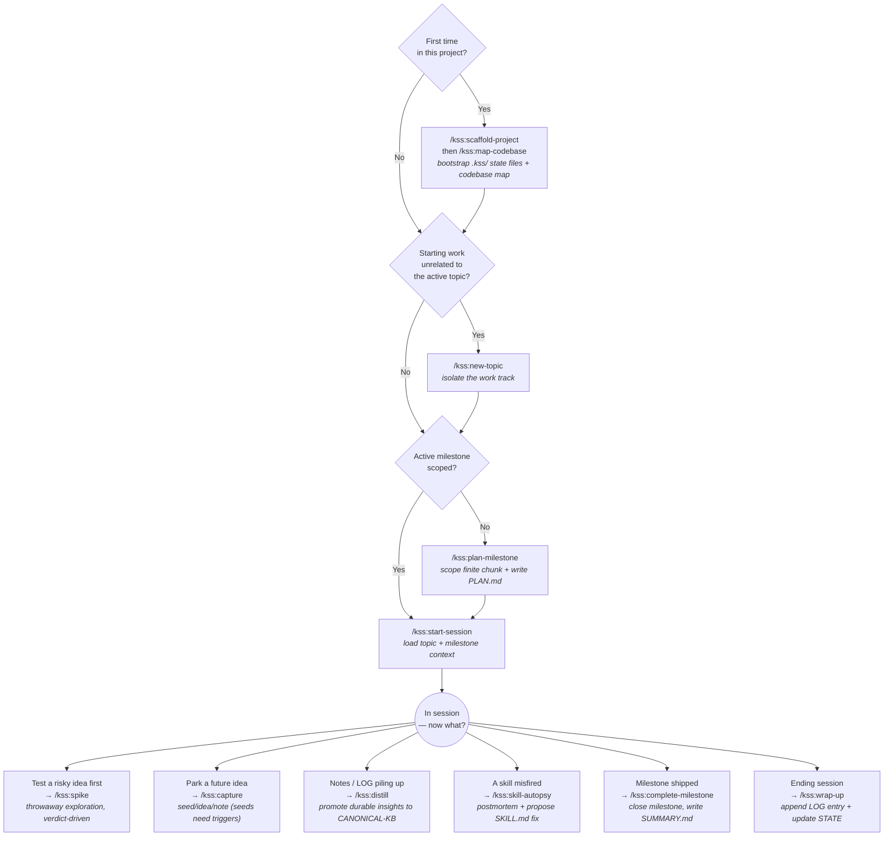

# kss — Keep Shit Simple

**Solo dev framework with reduced ceremony and high customization.**

I tested dozens of plugins, skills, and frameworks. I liked [GSD](https://github.com/gsd-build/get-shit-done) but wanted to make shit simpler — so I built this set of skills to keep my solo dev workflows organized and always ready to pick back up where I left them. Some of the lifecycle ideas (topic isolation, codebase map, trigger-conditioned seeds) are inspired by GSD; the multi-agent ceremony is not.

Mechanics: topics isolate unrelated work tracks; milestones scope finite work inside a topic; spikes test ideas before committing; canonical-KB captures durable cross-topic insights. An optional self-improvement loop (`skill-autopsy`) sharpens skills based on how you actually use them.

All state lives under `.kss/` at the project root.

## Commands

| Command | Layer | What it does |
|---|---|---|
| `/kss:scaffold-project` | Setup | Bootstrap `.kss/` shell. Run once per project. |
| `/kss:map-codebase` | Setup | Generate or refresh `.kss/codebase/{STACK,STRUCTURE,CONVENTIONS,VOCABULARY}.md`. VOCABULARY is append-only across runs. |
| `/kss:new-topic` | Lifecycle | Create a topic under `.kss/topics/`. Set as active. |
| `/kss:plan-milestone` | Lifecycle | Scope + plan a milestone within the active topic. |
| `/kss:complete-milestone` | Lifecycle | Close active milestone. With `--archive-topic`, archives whole topic. |
| `/kss:start-session` | Session | Load context for active topic + milestone. Run at session start. |
| `/kss:wrap-up` | Session | Append LOG entry, update STATE, optionally write a note. Run at session end. |
| `/kss:capture` | Knowledge | Drop a seed (with mandatory trigger), idea, or scratch note. |
| `/kss:distill` | Knowledge | Extract durable insights from LOG + notes into CANONICAL-KB. Surfaces vocabulary candidates for VOCABULARY.md. |
| `/kss:spike` | Exploration | Throwaway exploration with verdict-driven outcome. |
| `/kss:skill-autopsy` | Meta | Log a short report when a skill underperformed, or analyze accumulated reports to propose SKILL.md improvements. |

## Which skill when



Edge cases not in the diagram: rerun `map-codebase` after a major refactor, `complete-milestone --archive-topic` to archive the whole topic, and `skill-autopsy --consolidate` to analyze accumulated reports.

## Daily flow

```
once per project:    /kss:scaffold-project → /kss:map-codebase
once per topic:      /kss:new-topic
per milestone:       /kss:plan-milestone → (sessions...) → /kss:complete-milestone
per session:         /kss:start-session → (work) → /kss:wrap-up
                                                     ↑
                              /kss:capture (anytime), /kss:distill (periodically)
                              /kss:spike (when exploring)
                              /kss:skill-autopsy <skill> (after a frustration)
```

## Skill self-improvement loop

`skill-autopsy` is the only entry point that touches skill reports. Reports live at `~/kss-skill-reports/<skill-name>.md` (personal, never committed to the plugin source) and are read only when you invoke the autopsy.

Flow:
1. A skill misbehaves → run `/kss:skill-autopsy <skill-name>`. It interviews you and appends a short report.
2. Once 4+ reports accumulate, autopsy offers to consolidate. Past 5, the warning escalates.
3. Consolidate mode reads all reports for that skill, looks for recurring root causes, and proposes a concrete diff to its `SKILL.md`. If reports are vague or share no pattern, it says so honestly instead of inventing improvements.
4. **If you've cloned the repo and set `~/.kss-source` to your clone path**: the diff is applied to your clone and reports are cleared. You commit and push (or open a PR) on your own time.
5. **If you haven't**: the diff is *printed* for you to handle manually — fork later to apply, open a GitHub issue to send upstream, or just adapt your usage. Reports can be cleared either way.

`~/.kss-source` is optional and only relevant for forkers/contributors. Plain installs work fully; only the "apply diff to source" step is gated.

## `.kss/` layout

```
.kss/
├── PROJECT.md             # durable identity + topics index
├── STATE.md               # project-level pointer (active topic + milestone)
├── CANONICAL-KB.md        # cross-topic distilled knowledge
├── codebase/
│   ├── STACK.md           # overwrites on map-codebase rerun
│   ├── STRUCTURE.md       # overwrites on map-codebase rerun
│   ├── CONVENTIONS.md     # overwrites on map-codebase rerun
│   └── VOCABULARY.md      # append-only — auto-seeded by map-codebase, grown by distill
├── topics/
│   └── <topic-slug>/
│       ├── TOPIC.md       # identity, success bar, key decisions
│       ├── STATE.md       # current focus, blockers (overwritten)
│       ├── LOG.md         # session-by-session, terse, newest-on-top
│       ├── SEEDS.md       # parked items, each with a trigger condition
│       ├── MILESTONES.md  # shipped milestone summaries, newest-on-top
│       └── milestones/
│           ├── <version>-<slug>/        # active (no SUMMARY.md yet)
│           │   ├── PLAN.md
│           │   └── note-YYYYMMDD-*.md
│           └── <version>-<slug>/        # shipped (has SUMMARY.md)
│               ├── PLAN.md
│               ├── SUMMARY.md
│               └── note-YYYYMMDD-*.md
├── spikes/
│   └── YYYYMMDD-<slug>/
│       └── README.md      # question, approach, findings, verdict
└── archive/
    └── <archived-topic>/  # whole topics that shipped or were abandoned
```

## Key conventions

- **YAML frontmatter on every state file** — easy to grep/parse.
- **Newest-on-top** in LOG.md and MILESTONES.md.
- **Slugs are kebab-case.**
- **Dates: ISO `YYYY-MM-DD`** in frontmatter; `YYYYMMDD` as folder/file prefixes.
- **Active vs shipped milestone:** presence of `SUMMARY.md` is the marker.
- **Seeds require a trigger condition.** No exceptions. Items without triggers rot — `capture` will refuse them.
- **Never auto-commit.** Skills modify files; user runs `git` themselves.
- **Two-level state.** `.kss/STATE.md` is the *pointer*. Topic-level `STATE.md` is the *content*.

## Installation

This plugin is distributed via the `kss-plugins` marketplace. Inside Claude Code:

```
/plugin marketplace add fnneves/kss-plugins
/plugin install kss@kss-plugins
```

Commands are then invokable as `/kss:<skill-name>` in any project. The `kss` namespace comes from the `name` field in `plugin.json`.

To pull updates: `/plugin marketplace update kss-plugins` followed by `/plugin update kss@kss-plugins`. If the version field hasn't been bumped, run `/reload-plugins` to re-read the synced cache.

### Want to customize the skills?

If you want to tweak SKILL.md files locally (and optionally contribute improvements upstream):

1. Fork the marketplace repo on GitHub.
2. Clone your fork: `git clone https://github.com/<your-username>/kss-plugins ~/code/kss-plugins`.
3. Tell `skill-autopsy` where your clone lives: `echo "$HOME/code/kss-plugins/plugins/kss" > ~/.kss-source`.
4. Continue installing kss from the marketplace as above for runtime; your clone is the writable workbench.

For background on plugin marketplaces, version pinning, and source types, see the official Claude Code docs: <https://code.claude.com/docs/en/plugin-marketplaces>.

### Plugin structure (for reference)

```
kss/
├── .claude-plugin/
│   └── plugin.json          # plugin manifest
├── README.md
└── skills/
    ├── scaffold-project/SKILL.md
    └── ...
```

The `name` field in `plugin.json` (`"kss"`) becomes the slash-command namespace automatically — no separate prefix configuration needed.
